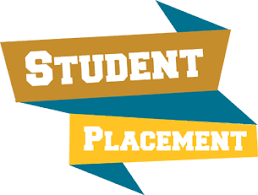

# Engineering-Students-Placements-Prediction-with-Supervised-models
This project aim to utilize different kinds of machine learning supervised model to predict whether students get placement or not. The models also help identify what features impact the prediction the most.

Data provided by Kaggle (https://www.kaggle.com/datasets/tejashvi14/engineering-placements-prediction)
